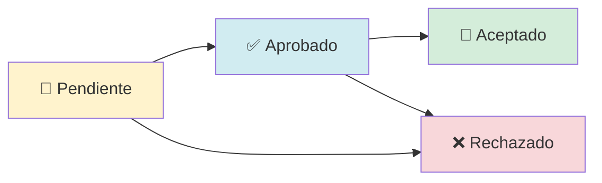

# 🏢 SiGestActivos - Sistema de Gestión de Activos

[](https://php.net)
[](https://www.microsoft.com/sql-server)
[](LICENSE)

Sistema integral de gestión de activos empresariales desarrollado en PHP con arquitectura MVC, diseñado para el control, seguimiento y administración completa de activos fijos con trazabilidad total y flujo de aprobaciones.

## 📋 Tabla de Contenidos

- [Características Principales](#-características-principales)
- [Arquitectura del Sistema](#-arquitectura-del-sistema)
- [Módulos del Sistema](#-módulos-del-sistema)
- [Sistema de Movimientos](#-sistema-de-movimientos)
- [Instalación](#-instalación)
- [Configuración](#-configuración)
- [Estructura del Proyecto](#-estructura-del-proyecto)
- [Base de Datos](#-base-de-datos)
- [Uso del Sistema](#-uso-del-sistema)
- [API Endpoints](#-api-endpoints)
- [Contribución](#-contribución)
- [Licencia](#-licencia)

## 🚀 Características Principales

### ✨ Gestión Integral de Activos
- **Registro completo** de activos con códigos únicos
- **Categorización** por tipos (Equipos de Cómputo, Vehículos, Maquinaria, etc.)
- **Estados de activos** (Activo, Inactivo, En Mantenimiento, Dado de Baja)
- **Componentes anidados** para activos complejos
- **Historial completo** de cambios y movimientos

### 🔄 Sistema de Movimientos con Estados
- **Flujo de aprobaciones** con trazabilidad completa
- **Estados de movimiento**: Pendiente → Aprobado → Aceptado/Rechazado
- **Separación de responsabilidades** (Autorizador vs Receptor)
- **Movimientos físicos automáticos** al aceptar
- **Historial de ubicaciones** y responsables

### 🏗️ Gestión Organizacional
- **Multi-empresa** y **multi-sucursal**
- **Ambientes** y **ubicaciones** específicas
- **Roles y permisos** granulares
- **Gestión de usuarios** con niveles de acceso

### 📊 Reportes y Auditoría
- **Reportes detallados** de movimientos
- **Auditoría completa** de todas las operaciones
- **Trazabilidad total** de cambios
- **Exportación** de datos

## 🏗️ Arquitectura del Sistema

```
┌─────────────────────────────────────────────────────────────┐
│                    ARQUITECTURA MVC                         │
├─────────────────────────────────────────────────────────────┤
│  VISTA (Views)           │  CONTROLADOR (Controllers)       │
│  ├── Layouts/            │  ├── GestionarActivosController  │
│  ├── Activos/            │  ├── GestionarMovimientoController│
│  ├── Movimientos/        │  ├── UsuarioController           │
│  ├── Reportes/           │  └── ...                         │
│  └── ...                 │                                  │
├─────────────────────────────────────────────────────────────┤
│                    MODELO (Models)                          │
│  ├── GestionarActivos.php                                  │
│  ├── GestionarMovimientos.php                              │
│  ├── Usuarios.php                                          │
│  └── ...                                                   │
├─────────────────────────────────────────────────────────────┤
│                BASE DE DATOS (SQL Server)                  │
│  ├── Tablas de Activos                                     │
│  ├── Tablas de Movimientos                                 │
│  ├── Tablas de Estados                                     │
│  ├── Stored Procedures                                     │
│  └── Vistas                                                │
└─────────────────────────────────────────────────────────────┘
```

## 📦 Módulos del Sistema

### 🏷️ Gestión de Activos
- **Registro de activos** con información completa
- **Códigos únicos** generados automáticamente
- **Categorización** por tipos y subcategorías
- **Gestión de componentes** anidados
- **Control de estados** y ubicaciones

### 🔄 Sistema de Movimientos
- **Creación de movimientos** entre ubicaciones
- **Flujo de aprobaciones** con estados
- **Validación de componentes** anidados
- **Ejecución automática** de movimientos físicos
- **Trazabilidad completa** de cambios

### 👥 Gestión de Usuarios
- **Roles y permisos** granulares
- **Multi-empresa** y **multi-sucursal**
- **Autenticación** y **autorización**
- **Gestión de sesiones**

### 🏢 Gestión Organizacional
- **Empresas** y **sucursales**
- **Ambientes** y **ubicaciones**
- **Proveedores** y **categorías**
- **Configuración** del sistema

### 📊 Reportes y Auditoría
- **Reportes de movimientos** detallados
- **Auditoría** de operaciones
- **Historial** de cambios
- **Exportación** de datos

## 🔄 Sistema de Movimientos

### Estados del Flujo



### Flujo de Trabajo

1. **📝 Creación** (Estado: Pendiente)
   - Usuario crea movimiento
   - Selecciona activos y destinos
   - Sistema registra intención

2. **✅ Aprobación** (Estado: Aprobado)
   - Autorizador revisa y aprueba
   - O rechaza si no procede
   - Se registra en historial

3. **🎯 Aceptación** (Estado: Aceptado)
   - Receptor acepta el movimiento
   - Sistema ejecuta movimiento físico
   - Actualiza ubicaciones automáticamente

### Características Técnicas

- **Stored Procedures** para operaciones críticas
- **Transacciones** para integridad de datos
- **Validaciones** de negocio
- **Logs** de auditoría completos

## 🛠️ Instalación

### Requisitos del Sistema

- **PHP 7.0+** con extensiones:
  - PDO
  - PDO_SQLSRV
  - JSON
  - Session
- **SQL Server 2012+**
- **Servidor Web** (Apache/Nginx)

### Pasos de Instalación

1. **Clonar el repositorio**
   ```bash
   git clone https://github.com/tu-usuario/SiGestActivos.git
   cd SiGestActivos
   ```

2. **Configurar la base de datos**
   ```sql
   -- Ejecutar script.sql en SQL Server
   -- Crear base de datos bdActivosV1
   ```

3. **Configurar conexión**
   ```php
   // app/config/configuracion.php
   $conexion = new PDO("sqlsrv:Server=TU_SERVIDOR;Database=bdActivosV1", "usuario", "password");
   ```

4. **Configurar servidor web**
   - Apuntar DocumentRoot a la carpeta del proyecto
   - Habilitar mod_rewrite (Apache)

5. **Inicializar sistema**
   - Acceder a la aplicación
   - Los estados se inicializan automáticamente

## ⚙️ Configuración

### Archivo de Configuración Principal

```php
// app/config/configuracion.php
class Conectar {
    public function ConexionBdPracticante() {
        $conexion = new PDO(
            "sqlsrv:Server=TU_SERVIDOR;Database=bdActivosV1", 
            "usuario", 
            "password"
        );
        return $conexion;
    }
}
```

### Variables de Entorno

- **Servidor de BD**: Configurar en `configuracion.php`
- **Logs**: Directorio `logs/` para errores
- **Sesiones**: Configuración automática

## 📁 Estructura del Proyecto

```
SiGestActivos/
├── 📁 app/
│   ├── 📁 config/           # Configuración del sistema
│   │   ├── configuracion.php
│   │   └── init.php
│   ├── 📁 controllers/      # Controladores MVC
│   │   ├── GestionarActivosController.php
│   │   ├── GestionarMovimientoController.php
│   │   ├── UsuarioController.php
│   │   └── ...
│   ├── 📁 models/          # Modelos de datos
│   │   ├── GestionarActivos.php
│   │   ├── GestionarMovimientos.php
│   │   ├── Usuarios.php
│   │   └── ...
│   └── 📁 views/           # Vistas e interfaces
│       ├── 📁 Layouts/     # Plantillas base
│       ├── 📁 Activos/     # Gestión de activos
│       ├── 📁 Movimientos/ # Sistema de movimientos
│       ├── 📁 Reportes/    # Reportes del sistema
│       └── ...
├── 📁 public/              # Archivos públicos
│   ├── 📁 css/
│   ├── 📁 js/
│   └── 📁 images/
├── 📁 logs/                # Logs del sistema
├── 📁 includes/            # Archivos de inclusión
├── script.sql              # Script de base de datos
├── index.php               # Punto de entrada
└── README.md               # Este archivo
```

## 🗄️ Base de Datos

### Tablas Principales

#### Activos
- `tActivos` - Información principal de activos
- `tUbicacionActivo` - Ubicaciones actuales e históricas
- `tHistorialUbicacion` - Historial de movimientos

#### Movimientos
- `tMovimientos` - Cabecera de movimientos
- `tDetalleMovimiento` - Detalle de activos por movimiento
- `tEstadoMovimiento` - Estados del sistema
- `tHistorialEstadoMovimiento` - Historial de cambios de estado

#### Organizacional
- `tEmpresa` - Empresas del sistema
- `tSucursal` - Sucursales por empresa
- `tAmbiente` - Ambientes/ubicaciones específicas
- `tTrabajador` - Usuarios del sistema

### Stored Procedures

- `sp_CrearMovimiento` - Crear movimiento con código único
- `sp_AprobarMovimiento` - Aprobar movimiento pendiente
- `sp_RechazarMovimiento` - Rechazar movimiento
- `sp_AceptarMovimiento` - Ejecutar movimiento físico
- `sp_RegistrarMovimientoActivov2` - Mover activos físicamente

## 💻 Uso del Sistema

### Gestión de Activos

1. **Crear Activo**
   ```
   Activos → Nuevo Activo → Llenar formulario → Guardar
   ```

2. **Buscar Activos**
   ```
   Activos → Filtros → Buscar por código/nombre/categoría
   ```

### Sistema de Movimientos

1. **Crear Movimiento**
   ```
   Movimientos → Nuevo Movimiento → Seleccionar destino → Agregar activos
   ```

2. **Aprobar Movimiento**
   ```
   Movimientos Enviados → ⚙️ → Aprobar
   ```

3. **Aceptar Movimiento**
   ```
   Movimientos Recibidos → ⚙️ → Aceptar Movimiento
   ```

### Flujo Típico

```
👤 Usuario A (Autorizador)
├── Crea movimiento (Pendiente)
├── Aprueba movimiento (Aprobado)

👤 Usuario B (Receptor)  
└── Acepta movimiento (Aceptado + Ejecución física)
```

## 🔌 API Endpoints

### Movimientos
- `POST /controllers/GestionarMovimientoController.php?action=RegistrarMovimiento`
- `POST /controllers/GestionarMovimientoController.php?action=aprobarMovimiento`
- `POST /controllers/GestionarMovimientoController.php?action=aceptarMovimiento`
- `POST /controllers/GestionarMovimientoController.php?action=listarMovimientosEnviados`
- `POST /controllers/GestionarMovimientoController.php?action=listarMovimientosRecibidos`

### Activos
- `POST /controllers/GestionarActivosController.php?action=listar`
- `POST /controllers/GestionarActivosController.php?action=guardar`
- `POST /controllers/GestionarActivosController.php?action=mostrar`

## 🤝 Contribución

1. **Fork** el proyecto
2. **Crear** una rama para tu feature (`git checkout -b feature/AmazingFeature`)
3. **Commit** tus cambios (`git commit -m 'Add some AmazingFeature'`)
4. **Push** a la rama (`git push origin feature/AmazingFeature`)
5. **Abrir** un Pull Request

### Estándares de Código

- **PSR-4** para autoloading
- **Comentarios** en español
- **Nombres descriptivos** para variables y funciones
- **Validación** de datos de entrada
- **Manejo de errores** con try-catch

## 📄 Licencia

Este proyecto está bajo la Licencia MIT - ver el archivo [LICENSE](LICENSE) para detalles.

## 👨‍💻 Desarrolladores

- **Equipo de Desarrollo** - Desarrollo inicial y mantenimiento

## 📞 Soporte

Para soporte técnico o consultas:
- **Issues**: [GitHub Issues](https://github.com/bhyanx/SiGestActivosV2/issues)
- **Email**: bhyanxdev@gmail.com

## 🔄 Changelog

### v2.0.0 (2025-01-08)
- ✅ Sistema de estados para movimientos
- ✅ Flujo de aprobaciones completo
- ✅ Trazabilidad total de cambios
- ✅ Validación de componentes anidados
- ✅ Interfaz mejorada con badges de estado

### v1.0.0 (2024)
- ✅ Sistema base de gestión de activos
- ✅ CRUD completo de activos
- ✅ Sistema de usuarios y permisos
- ✅ Reportes básicos

---

⭐ **¡Si este proyecto te fue útil, no olvides darle una estrella!** ⭐
